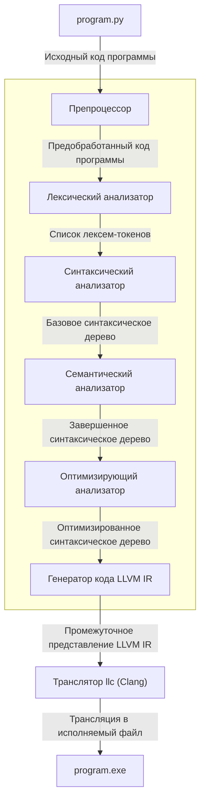

[Назад](README.md)

# Обзор архитектуры

Компиляция кода осуществляется в несколько этапов. За каждый из этапов отвечает один из представленных в рамках проекта
модулей, взаимодействующих подобно конвейеру: выходные данные одного этапа являются входными для следующего.
Процесс показан на графе:

