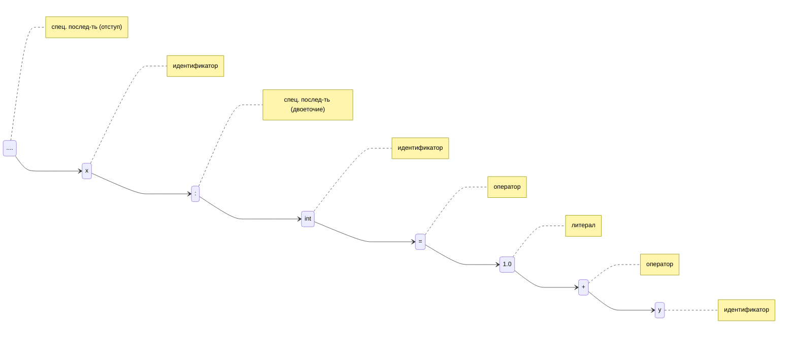

# Пример работы анализатора

Рассмотрим работу лексического анализатора на примере.

Пусть на вход поступает строка

```py
    x: int = 1.0 + y
```

Разбиение этого выражения на токены представлено на схеме:



[_Назад_](README.md)
