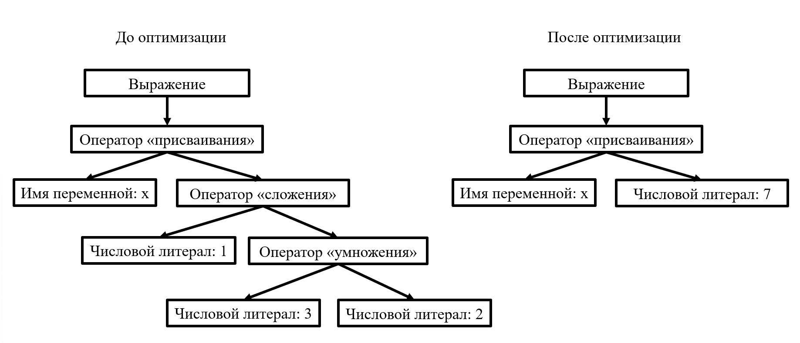

# Свертка констант

Свертка констант – оптимизация в компиляторах, уменьшающая избыточные вычисления, путем замены константных выражений на их значения.

## Пример


### Вид на уровне кода

До оптимизации:

```py
def main() -> None:
    x: int = 1 + 3 * 2

```

После оптимизации:

```py
def main() -> None:
    x: int = 7
```


### Вид на уровне синтаксических деревьев




Алгоритмически в синтактическом дереве необходимо искать узлы дерева одного уровня (т.е. имеющие общего предка), содержащие только числовые константы. Тогда вышестоящий узел можно будет свернуть до числового литерала. В процессе рекурсивного обхода дерева происходит свертка всех константных выражений.

[_Назад_](README.md)
