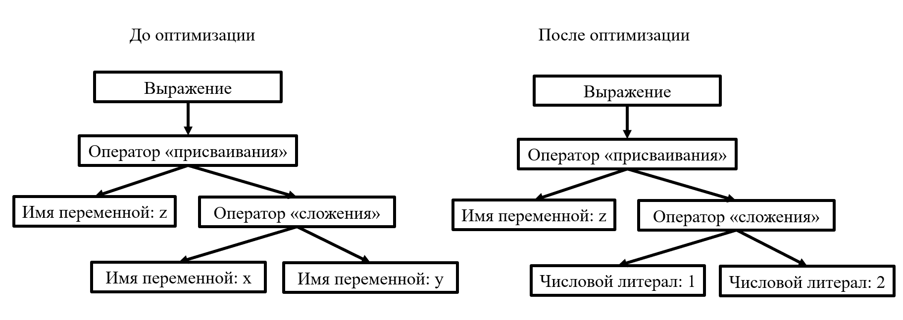

# Распространение констант

Распространение констант – оптимизация в компиляторах, уменьшающая избыточные вычисления, путем замены выражений, содержащих переменные, которые постоянны при любом возможном пути выполнения. После распространения констант можно выполнить их свертку. 

## Пример


### Вид на уровне кода

До оптимизации:

```py
def main() -> None:
    x: int = 1
         y: int = 2
    z: int = x + y
```

После оптимизации:

```py
def main() -> None:
    x: int = 1
         y: int = 2
    z: int = 1 + 2
```


### Вид на уровне синтаксических деревьев




Для реализации оптимизации, необходимо:
* определять «изменяемость» переменной (контролируется полем, содержащимся в таблице символов);
* сохранить значения «неизменяемых» переменных (используется структура данных, хранящая значения для каждой переменной в своей области видимости);

Алгоритм заключается в том, что при рекурсивном проходе дерева анализируются переменные, входящие в состав выражений, для которых параметр «неизменяемости» не нарушается. В этом случае возможно подставить значения констант и провести их свертку.

В примере рассмотрен тривиальный случай для этой оптимизации. При использовании функций, условных переходов и циклов анализ «изменяемости» переменных сильно усложняется. В реализации модуля в отличии от других компиляторов, не используется граф потока управления, но выполнение оптимизации возможно из-за структуры дерева, которая содержит для каждой области видимости свою таблицу символов.

[_Назад_](README.md)
