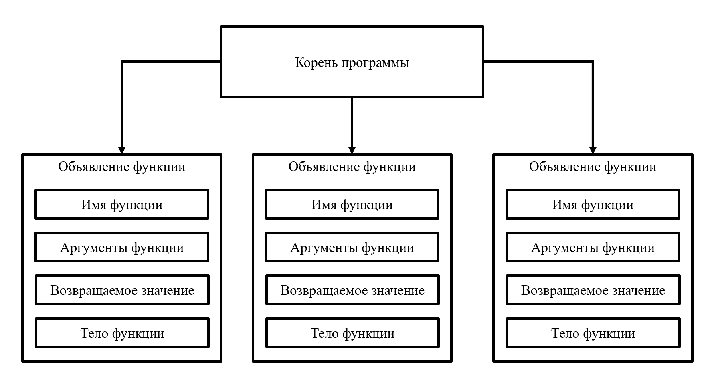

# Заполнение таблицы функций

На этой стадии происходит анализ объявлений функций, происходящий на верхнем уровне дерева, и создание новых записей в таблице функций.

Алгоритмически необходимо обойти в ширину верхний уровень программы и из каждого встреченного объявления функции выделить ее имя, аргументы, и возвращаемое значение для формирования новой записи в таблице функций.

[_Назад_](README.md)
