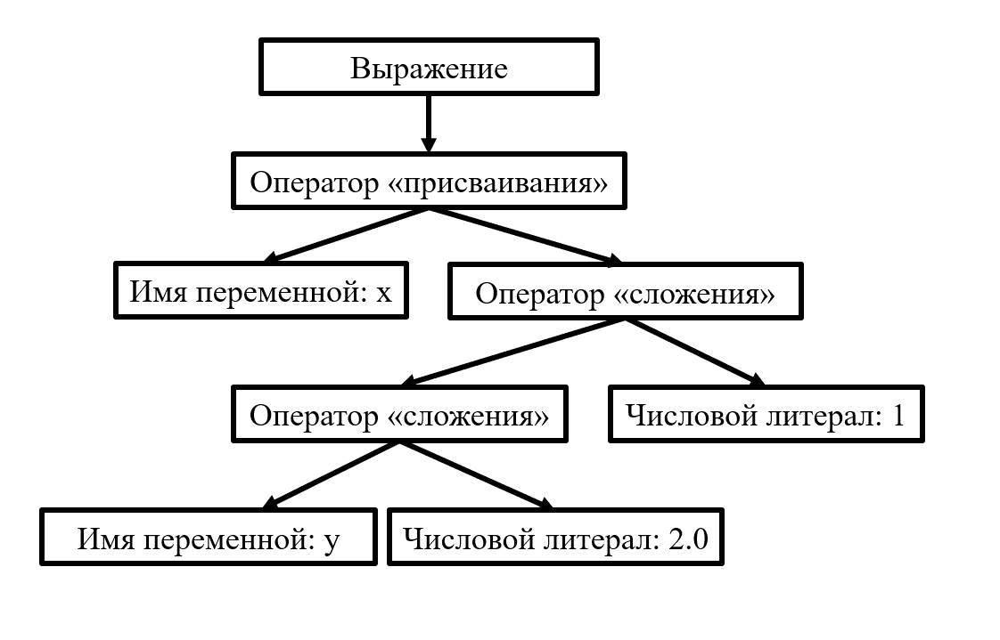
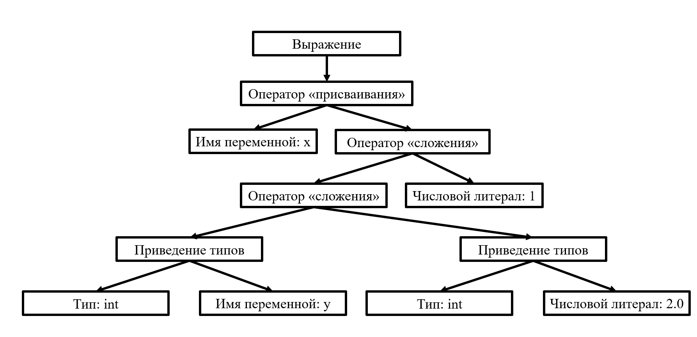

# Проверка типов

Проверка типов – важная часть семантического анализа. Модуль проверяет, соответствуют ли типы операндов в выражениях. Выражения можно разделить на два типа:
* с заранее известным типом, к которому необходимо выполнить приведение;
* с заранее неизвестным типом.

Для каждого типа выражения необходимы свои отдельные процедуры их обработки.

Например, для выражения `x = y + 2.0 + 1` заранее известен тип, так как выполняется присваивание переменой «x» некоторого значения. А для выражения, содержащегося в параметрах вызова функции «print(x + y + 1)», тип, к которому его необходимо привести заранее неизвестен.
В первом случае, необходимо рекурсивно обходить выражение и для всех узлов, для которых тип не совпадает с заранее известным, нужно выполнить вставку конструкции приведения типа.

До проверки типов:

После проверки типов:

Во втором случае необходимо рекурсивно спуститься к листьям выражения и запоминать встреченные типы узлов. Если среди типов был встречен тип с плавающей точкой, то остальные операнды выражения приводятся к нему, иначе изменений не происходит.

[_Назад_](README.md)
