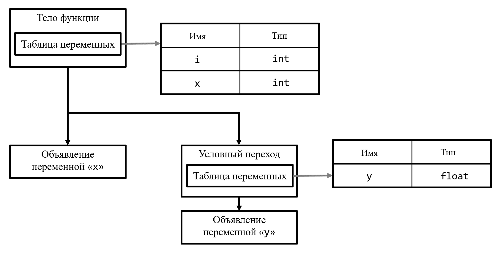

# Создание таблиц переменных

После заполнения таблиц функций нужно проанализировать их реализации, а именно тела. Для корректной работы дальнейших стадий модуля необходимо обеспечить правильную работу с областями видимости программы.


## Пример

Пример кода

```cpp
def main(i: int) -> None:
    x: int = 2
    if 2 > 1:
        y: float = 1.0
```

Схематический вид на уровне синтаксических деревьев



При входе в тело функции создается пустая таблица символов, которая привязывается к этому телу. Указатель на привязанную таблицу добавляется в список, содержащийся во вспомогательном классе. Так как функция имеет аргументы, то необходимо добавить их в эту таблицу (в примере переменная i типа int). Далее для каждого встреченного объявления переменной необходимо добавлять ее в таблицу переменных анализируемой области видимости (добавляем переменную x типа int в таблицу, привязанную к телу функции). Все условные переходы или циклы содержат в себе свою таблицу символов, поэтому к ним привязываются новые пустые таблицы и указатели на них добавляются в начало списка вспомогательного класса. При анализе веток условных переходов добавляем в их таблицы символов встреченные объявленные переменные (в примере переменная y типа float).

Для работы с областью видимости программы используется список, содержащий в себе таблицы переменных. При встрече в каком-либо выражении имени переменной производится проверка ее существования в данной области видимости. Так как для каждой новой области ее таблица символов добавляется в список спереди, то в поиске первыми будут просматриваться переменные, объявленные в данной области, а после – в родительских областях. В примере выше, если в выражении внутри условного оператора встретится имя переменной, то сначала будет произведен поиск по таблице, относящейся к условному оператору (таблица, содержащая только переменную y), а потом для таблицы тела функции (таблица, содержащая только переменные i, x).

[_Назад_](README.md)
