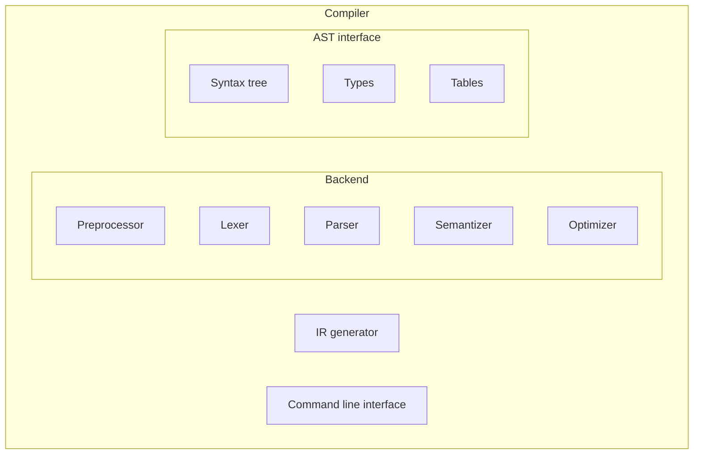

# Архитектура продукта

Общая схема работы готового продукта «Компилятор» представляется следующим образом: консольное приложение запускает внутри себя компоненты Backend, а именно: Preprocessor, Lexer, Parser, Semantizer, Optimizer, и IR Generator. В процессе анализируется файл исходного кода на Python-подобном языке, строится синтаксическое дерево и генерируется промежуточное представление программы в виде кода на языке LLVM IR. Полученный файл может быть транслирован в объектный с помощью утилиты LLCompiler (llc) и в дальнейшем использован компоновщиком для получения исполняемого файла.

На схеме в виде блоков представлены следующие компоненты:
* Compiler – проект «Компилятор»:
  * Backend – внутренняя (основная) логика:
    * Preprocessor – препроцессор;
    * Lexer – лексический анализатор;
    * Parser – синтаксический анализатор;
    * Semantizer – семантический анализатор;
    * Optimizer – оптимизирующий анализатор;
  * AST (abstract syntax tree) interface – инструменты для работы с абстрактным синтаксическим деревом:
    * Syntax tree – структуры данных (собственно АСД);
    * Types – вспомогательные структуры для идентификации типов;
    * Tables – структуры данных для хранения таблиц символов;
  * IR generator – генератор промежуточного представления на языке LLVM IR;
  * Command line interface – консольное приложение.

Для обеспечения корректности работы будет разработан комплект функциональных и интеграционных тестов для компонентов проекта.

Предполагается, что компилятор будет работать с Python-подобным статически типизированным языком, в котором будут присутствовать основные языковые конструкции (объявления функций и переменных, условия, циклы, вызовы функций, вычисление арифметико-логических выражений), возможность вывода текста на экран и считывания данных с клавиатуры.

[_Назад_](README.md)
